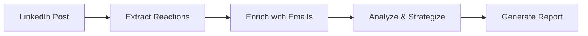

# LinkedIn Reaction Reach - CrewAI Implementation

A CrewAI-powered workflow that automatically extracts reactions from your most recent LinkedIn post and enriches the profiles with email addresses using Apollo.io.

## 🚀 Features

- **Automated LinkedIn Reaction Extraction**: Uses Browserbase with persistent contexts for authenticated access
- **Intelligent Element Selection**: Leverages GPT-4o to dynamically find the right elements to click
- **Email Enrichment**: Integrates with Apollo.io to find professional email addresses
- **Personalized Outreach Strategy**: Analyzes profiles and creates tiered outreach recommendations
- **Comprehensive Reporting**: Generates detailed markdown reports with actionable insights

## 📋 Prerequisites

- Python 3.10+
- CrewAI
- API Keys for:
  - Browserbase
  - OpenAI (GPT-4o)
  - Apollo.io

## 🛠️ Installation

1. Clone the repository:
```bash
git clone https://github.com/yourusername/linkedin-reaction-reach.git
cd linkedin-reaction-reach
```

2. Install dependencies using CrewAI:
```bash
crewai install
```

3. Copy the environment file and add your API keys:
```bash
cp .env.example .env
# Edit .env with your API keys
```

## 🎯 Usage

### Basic Usage

Run the crew with default settings:
```bash
crewai run
```

### Advanced Usage

Run with custom parameters:
```bash
# With custom Browserbase context
python -m linkedin_reaction_reach.main --context-id "your-context-id"

# With personal email revelation (uses Apollo credits)
python -m linkedin_reaction_reach.main --reveal-personal-emails

# With custom retry limit
python -m linkedin_reaction_reach.main --max-retries 5
```

## 🤖 Agents

1. **LinkedIn Extractor**: Navigates LinkedIn and extracts reaction data
2. **Apollo Enricher**: Enriches profiles with email addresses
3. **Outreach Strategist**: Creates personalized outreach strategies
4. **Report Generator**: Produces comprehensive reports

## 📊 Workflow



## 📁 Output

The crew generates:
- `reactions_data_[timestamp].json` - Raw reaction data
- `output/linkedin_reactions_report.md` - Comprehensive report with:
  - Executive summary
  - Detailed reactor profiles
  - Email enrichment results
  - Outreach recommendations
  - Visual analytics

## 🔧 Configuration

### Browserbase Context

The tool uses Browserbase contexts for persistent LinkedIn authentication:

1. Create a context in Browserbase
2. Log into LinkedIn manually once
3. Use the context ID in your configuration

### Apollo.io Settings

Configure Apollo enrichment in your inputs:
- `reveal_personal_emails`: Whether to show personal emails (uses credits)
- Rate limits are handled automatically

## 🛡️ Security Notes

- Never commit your `.env` file
- Use Browserbase contexts instead of storing LinkedIn credentials
- Apollo API keys should have appropriate permissions
- Consider rate limiting for production use

## 🤝 Contributing

1. Fork the repository
2. Create your feature branch
3. Commit your changes
4. Push to the branch
5. Create a Pull Request

## 📄 License

MIT License - see LICENSE file for details

## 🙋‍♂️ Support

For issues or questions:
- Create an issue in the GitHub repository
- Check the CrewAI documentation
- Review the Browserbase and Apollo.io docs